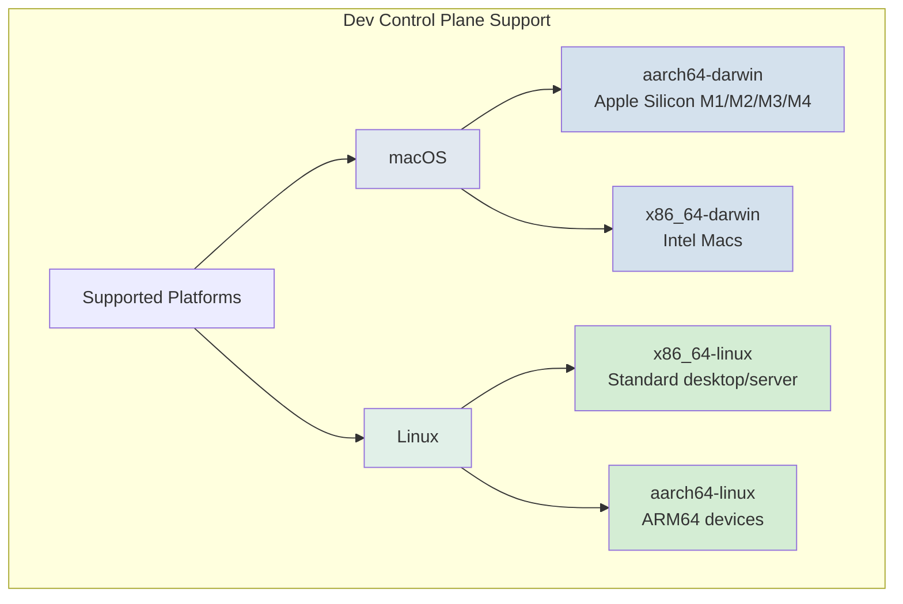
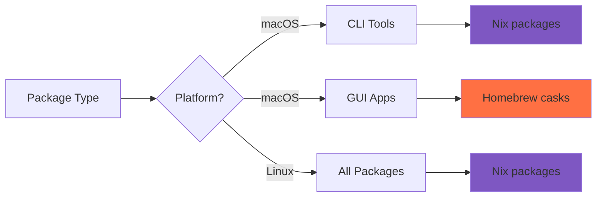
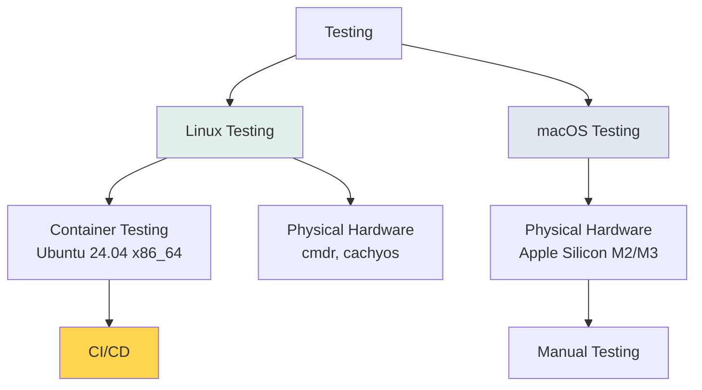

# Nix Platform Support

A comprehensive overview of what platforms Nix supports and how this project leverages them.

## Official Nix Platform Support

Nix (the package manager) currently supports the following platforms:

### Linux
- **x86_64-linux** - 64-bit Intel/AMD (most common)
- **aarch64-linux** - 64-bit ARM (Raspberry Pi 4+, AWS Graviton, etc.)
- **i686-linux** - 32-bit Intel/AMD (legacy, limited support)

### macOS (Darwin)
- **aarch64-darwin** - Apple Silicon (M1, M2, M3, M4, etc.)
- **x86_64-darwin** - Intel Macs

### Other Platforms
- **WSL2** (Windows Subsystem for Linux) - Runs Linux Nix on Windows
- **Docker** - Official `nixos/nix` container images
- **FreeBSD** - Experimental/community support

## Platform Support Matrix

```
┌──────────────────────────────────────────────────────────────┐
│                    Nix Platform Support                      │
├──────────────┬─────────┬─────────┬─────────┬─────────────────┤
│ Platform     │ x86_64  │ aarch64 │ i686    │ Status          │
├──────────────┼─────────┼─────────┼─────────┼─────────────────┤
│ Linux        │    ✅   │    ✅   │    ⚠️   │ Fully supported │
│ macOS        │    ✅   │    ✅   │    ❌   │ Fully supported │
│ FreeBSD      │    🧪   │    🧪   │    ❌   │ Experimental    │
│ WSL2         │    ✅   │    ✅   │    ❌   │ Via Linux       │
│ Windows      │    ❌   │    ❌   │    ❌   │ Use WSL2        │
└──────────────┴─────────┴─────────┴─────────┴─────────────────┘

Legend:
  ✅ = Fully supported
  ⚠️  = Legacy/limited support
  🧪 = Experimental/community
  ❌ = Not supported
```

## Linux Distribution Support

Nix works on **any Linux distribution** because it doesn't depend on the host system's package manager:

### Tested & Verified
- ✅ **NixOS** - Native Nix-based Linux distribution
- ✅ **Ubuntu** / Debian / Mint - Tested in CI containers
- ✅ **Arch Linux** - Used for primary workstations (cmdr, cachyos)
- ✅ **CachyOS** - Arch-based optimized distro
- ✅ **Fedora** / RHEL / CentOS - Community tested
- ✅ **Alpine Linux** - Lightweight distro

### Should Work (Untested)
- ⚪ **openSUSE** / SUSE
- ⚪ **Gentoo**
- ⚪ **Void Linux**
- ⚪ **Linux Mint**
- ⚪ Any distro with bash, curl, and systemd

## This Project's Platform Coverage



### Current Host Inventory

| Host | Distro | Architecture | Platform | Status |
|------|--------|--------------|----------|--------|
| **apple-studio-m2-max** | macOS | aarch64 | aarch64-darwin | ✅ Active |
| **apple-macbook-m3-pro** | macOS | aarch64 | aarch64-darwin | ✅ Active |
| **cmdr** | Arch Linux | x86_64 | x86_64-linux | ✅ Active |
| **cachyos** | CachyOS (Arch) | x86_64 | x86_64-linux | ✅ Active |

## Installation Methods by Platform

### macOS

```bash
# Via make bootstrap (recommended)
make bootstrap

# Direct installation (official)
sh <(curl --proto '=https' --tlsv1.2 -L https://nixos.org/nix/install)

# Determinate Systems installer (used by this project)
curl --proto '=https' --tlsv1.2 -sSf -L https://install.determinate.systems/nix | sh -s -- install
```

**What gets installed:**
1. Nix package manager (multi-user daemon)
2. Flakes enabled by default
3. `/nix` directory with root ownership
4. `nixbld` group and build users

### Linux (Any Distro)

```bash
# Via make bootstrap (recommended)
make bootstrap

# Direct installation (official)
sh <(curl --proto '=https' --tlsv1.2 -L https://nixos.org/nix/install) --daemon

# Determinate Systems installer (used by this project)
curl --proto '=https' --tlsv1.2 -sSf -L https://install.determinate.systems/nix | sh -s -- install
```

**What gets installed:**
1. Nix package manager (multi-user daemon)
2. Systemd service for nix-daemon
3. Flakes enabled by default
4. `/nix` directory with root ownership

### NixOS

Nix is pre-installed! Just enable flakes:

```nix
# /etc/nixos/configuration.nix
nix.settings.experimental-features = [ "nix-command" "flakes" ];
```

### WSL2 (Windows)

```bash
# Enable systemd in WSL first (WSL 0.67.6+)
# Then install Nix daemon
sh <(curl --proto '=https' --tlsv1.2 -L https://nixos.org/nix/install) --daemon
```

### Docker

```bash
# Official Nix container
docker run -it nixos/nix

# With workspace mount
docker run -it -v $(pwd):/workspace nixos/nix
```

## Platform-Specific Package Management

This project uses different installation methods based on what works best for each platform:



### macOS Package Strategy

| Package Type | Installation Method | Why |
|--------------|-------------------|-----|
| **CLI tools** | Nix | Reproducible, universal |
| **GUI apps** | Homebrew casks | Better macOS integration |
| **System settings** | nix-darwin | Declarative system config |

**Example:**
- ✅ Nix: `ripgrep`, `fd`, `neovim`, `tmux`
- ✅ Homebrew: `Ghostty`, `Firefox`, `VSCode`, `Arc`
- ✅ nix-darwin: System preferences, dock settings

### Linux Package Strategy

| Package Type | Installation Method | Why |
|--------------|-------------------|-----|
| **CLI tools** | Nix | Reproducible, universal |
| **GUI apps** | Nix | Native packaging |
| **System settings** | Home Manager | User-level config |

**Example:**
- ✅ Nix: `ripgrep`, `fd`, `neovim`, `tmux`
- ✅ Nix: `ghostty`, `firefox`, `code`
- ✅ Home Manager: Dotfiles, XDG config

## Architecture Detection

The project auto-detects architecture during host scaffolding:

```bash
# Detect current architecture
ARCH="$(uname -m)"

# Map to Nix platform
case "$ARCH" in
  arm64|aarch64) 
    PLATFORM="aarch64-*"  # * = darwin or linux
    ;;
  x86_64)
    PLATFORM="x86_64-*"
    ;;
  i686)
    PLATFORM="i686-linux"  # Legacy only
    ;;
esac
```

## Cross-Platform Considerations

### What Works Everywhere
✅ All CLI tools in `home/04-modules/cli/core-utils/`
✅ Shell configuration (zsh, starship, atuin)
✅ TUI applications (tmux, neovim, lazygit, k9s)
✅ Development tools (git, direnv, docker/podman)
✅ Language runtimes (nix manages versions)

### Platform-Specific Packages
⚠️ `home/01-platforms/darwin-packages.nix` - macOS-only Nix packages
⚠️ `home/01-platforms/linux-packages.nix` - Linux-only Nix packages
⚠️ `darwin/system.nix` - macOS system settings + Homebrew casks

### Why Some Packages Are Platform-Specific

**Linux-only examples:**
- `slirp4netns` - Rootless networking for containers (Linux kernel feature)
- `fuse-overlayfs` - Rootless container storage (FUSE filesystem)
- `xdg-utils` - Desktop integration utilities

**macOS-only examples:**
- Currently empty - most GUI apps use Homebrew instead

## Testing Strategy by Platform



### Container Testing (Linux x86_64)
```bash
make test-shell       # Ubuntu 24.04 container
cd /workspace
home-manager switch --flake .#cmdr
```

### GitHub Actions CI
- ✅ Linux x86_64 (Ubuntu runners)
- ✅ macOS aarch64 (M1 runners)
- ✅ Flake validation
- ✅ Home Manager build tests

## Cloud Platform Support

### AWS EC2
Official NixOS AMIs available for:
- ✅ x86_64 instances
- ✅ arm64 instances (Graviton)
- 🔄 Updated weekly
- 🗑️ Images older than 90 days deprecated

### Other Cloud Providers
- ✅ **Google Cloud** - Use standard Linux images + Nix install
- ✅ **Azure** - Use standard Linux images + Nix install
- ✅ **DigitalOcean** - Use standard Linux images + Nix install
- ✅ **Hetzner** - Use standard Linux images + Nix install

## Future Platform Support

### Potential Additions
- 🔮 **NixOS hosts** - Dedicated NixOS machines (directory structure exists)
- 🔮 **Ubuntu hosts** - Separate Ubuntu host directory (structure exists)
- 🔮 **Raspberry Pi** - aarch64-linux support already present
- 🔮 **Steam Deck** - Arch-based, could use existing patterns

### Not Planned
- ❌ **Windows native** - Use WSL2 instead
- ❌ **BSD variants** - Experimental Nix support only
- ❌ **i686 (32-bit)** - Legacy architecture, declining support

## Platform-Specific Troubleshooting

### macOS
```bash
# Check Homebrew installation
brew doctor

# Check nix-darwin
darwin-rebuild --version

# Fix /etc/bashrc conflicts (first-time bootstrap)
sudo mv /etc/bashrc /etc/bashrc.before-nix-darwin
```

### Linux
```bash
# Check Nix daemon
systemctl --user status nix-daemon

# Check multi-user installation
ls -l /nix/var/nix/profiles/

# Fix permissions
sudo chown -R root:nixbld /nix
```

### WSL2
```bash
# Enable systemd first
sudo nano /etc/wsl.conf
# Add: [boot]
#      systemd=true

# Restart WSL
wsl --shutdown
```

## Summary

| Aspect | Supported | Notes |
|--------|-----------|-------|
| **Linux distros** | All major distros | Arch, Ubuntu, NixOS, etc. |
| **macOS versions** | 10.15+ | Apple Silicon preferred |
| **Architectures** | x86_64, aarch64 | i686 legacy only |
| **Containers** | Docker, Podman | Official images available |
| **Cloud** | All major providers | AWS has official AMIs |
| **Windows** | Via WSL2 only | Native not supported |

**Key Principle:** Nix is platform-agnostic by design. This project maintains that philosophy while using platform-specific tools (Homebrew, nix-darwin) only where they provide genuine value.

---

**Related Documentation:**
- [README.md](../README.md) - Project overview
- [bootstrap.md](../Getting-Started/bootstrap.md) - Getting started guide
- [Contributing](../Contributing/README.md) - AI agent guidelines
- [Nix Manual - Supported Platforms](https://nixos.org/manual/nix/stable/installation/supported-platforms.html)
